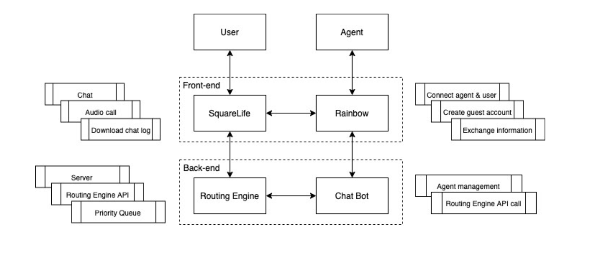
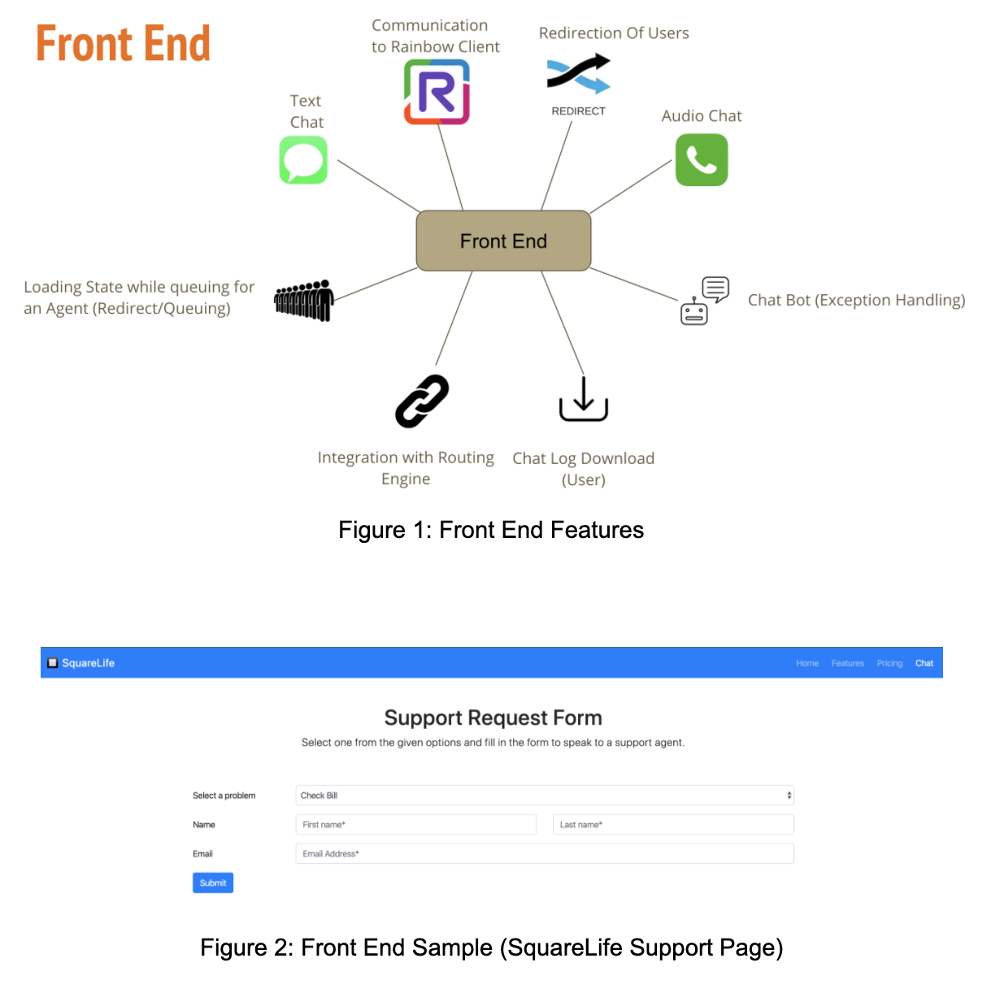
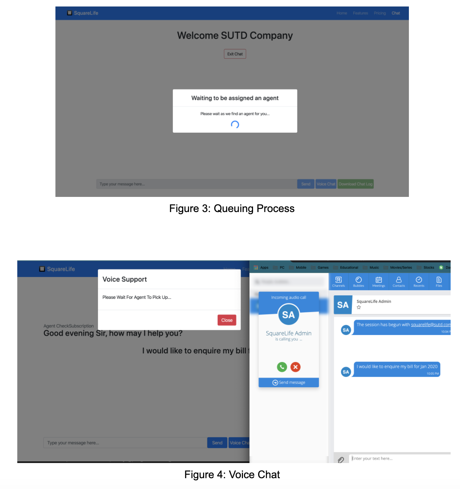
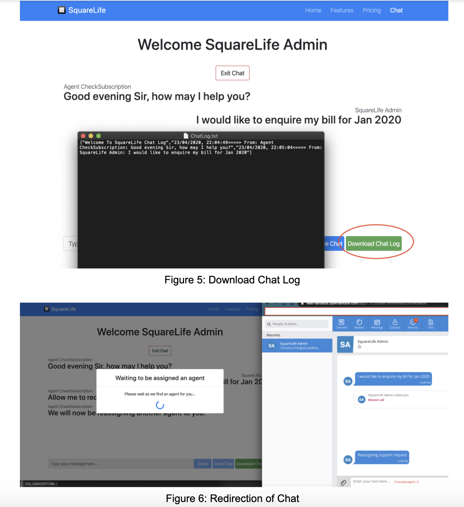
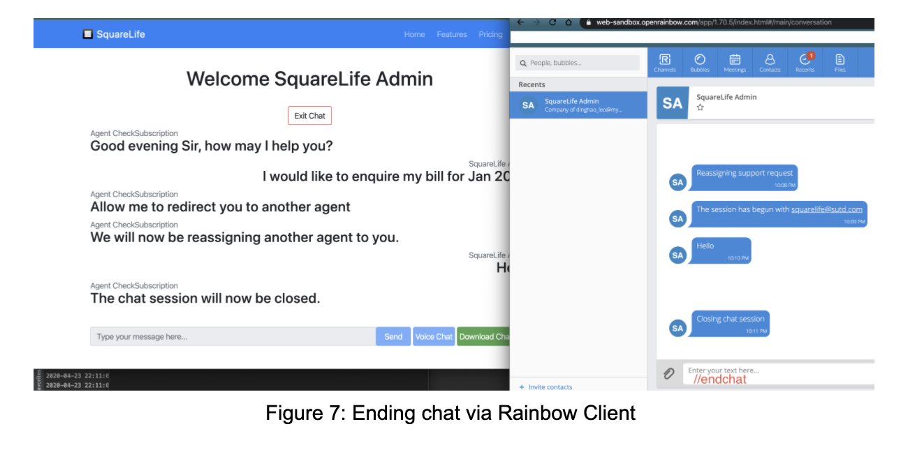
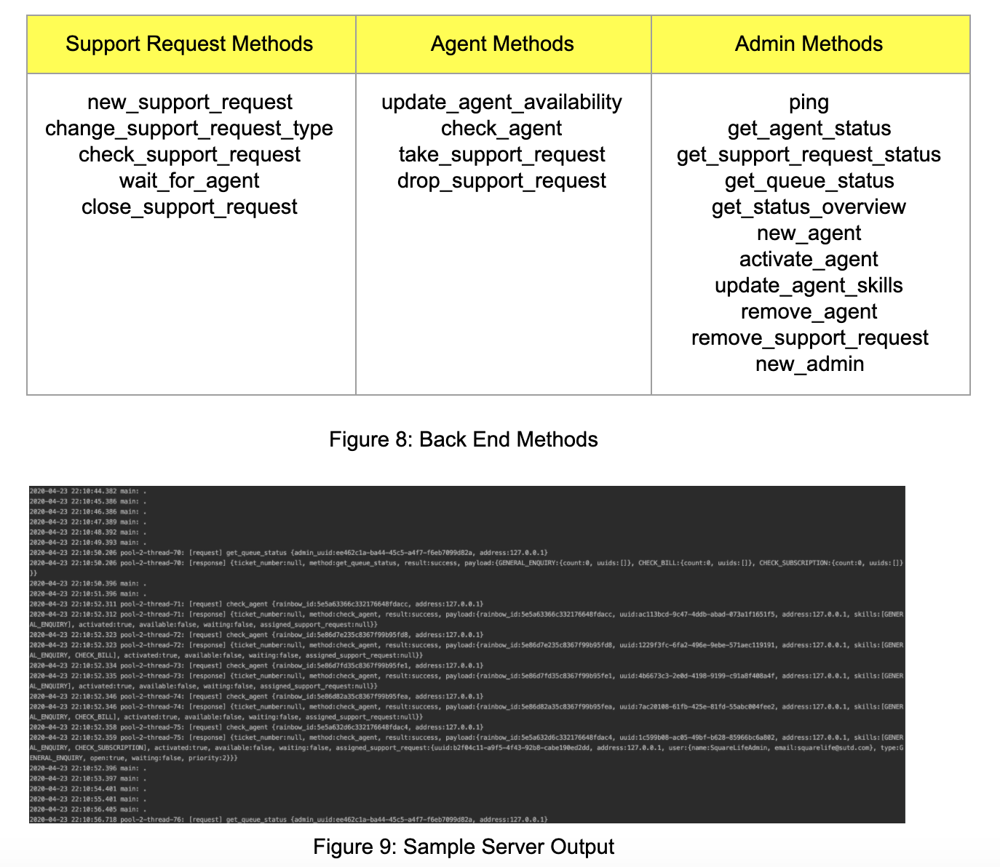

  
# 🔲 SquareLife 🔲    
 #### Finally a Customer Service Provider for the people, by the people.    
 ---    
### SUTD 50.003 : Elements of Software Construction Y2020: 
> Project 1 (Client: Alcatel Lucent Technologies)  
> Title: Contact Center Routing for Rainbow Communication Platform  
> Project Context (provide a clear description of the project context and its relevance):
 
 
 Rainbow is a cloud communication platform providing unified communication (UC) services such as chat, audio and video calls (https://www.openrainbow.com/). Rainbow is frequently used by contact center agents to handle support requests from customers. Rainbow also provides SDK and API for developers to build custom UC applications. Contact center agents need a routing engine to organise incoming chat requests and voice calls from customers into queues and route them to available agents based on agent availability, skills etc. Project Objectives (provide a clear, concise description of the project objectives): To develop a routing engine that routes incoming support requests (chat and audio calls) to the right agent based on agent availability, skills etc. Project Deliverables (mention all deliverables):    
    
1. A web page simulating customer's website where their users can request for    
   support via chat or audio call.    
2. A routing engine that routes incoming chat and audio call requests to the right    
   agent based on agent availability, skills etc    
    
---    
 SquareLife runs on Alactel Lucent Rainbow SDK , our project consist of 3 components:    
    
- [FrontEnd (ExpressJS & RainbowWebSDK) & BackEnd (RainbowNodeSDK)](/FrontEnd)    
- [Routing Engine (Java)](https://github.com/han-keong/routingengine)    
- [Unit Testing (Java: J-Unit Testing and Selenium)](/SquareLifeTest)    
### Overview


---  
### Documentation    
 ##### How to run  (LocalHost)  
  1. Compile and run [Routing Engine](https://github.com/han-keong/routingengine) and listen on port 4000 by running   
- On your Unix machine (e.g. MacOS)
    ```java -cp "bin:lib/*" com.routingengine.server.Server 4000 ```  
- On Windows with  [Git Bash](https://www.atlassian.com/git/tutorials/install-git#windows)
    ```java -cp "bin\;lib/*" com.routingengine.server.Server 4000 ```
 2. Change directory to 50_003_SquareLife/FrontEnd Folder   
 ```$ cd 50_003_SquareLife/FrontEnd```  
3. Install required packages by running ```$ npm i```  
4. When ```SDK Starting, SDK Started, Express is running on port 3005``` is shown on the console, proceed to ```https://localhost:3005```*
<sup>*https is required for the Voice Chat Function</sup>
6. Sign in to Rainbow client sandbox https://web-sandbox.openrainbow.com and login    
7. To test, change all routing engine agent credentials to your own so that the customer request is redirected to you    
8. User can experiment with multiple chat requests by opening several tabs of the same server and sending multiple requests    
    
##### Features    
 1. Personal details    
    
On server startup, customers can fill up the support request form with their particulars as well as their problem. The chosen problem will determine the specific agent assigned to them, based on their expertise to solve that particular problem. Customer will click the submit button to submit the support request. They will then be placed into a queue to wait for the assigned agent. This queue is handled by the routing engine.    
    
2. Chat functions    
    
- Messaging
	
	Text communication between the user and the agent
- Voice chat    
    
  User has to authorize the application to access media service before voice chat function can be enabled. Checks whether a microphone can be detected before being able to initiate. Both user or agent can initiate a voice chat.    
    
- Download chat log    
    
  User can save the chat log locally to their file storage. Agents can use the Rainbow API to search for the chat ID and view the log via the Rainbow client.    
    
3. Reassign agents    
    
Agents can choose to reassign a new agent to the customer should they feel that another agent can serve them better. They can do so by typing "//reassignagent" into the chat. This will place the customer in a priority queue for the agent of that particular skill.    
    
4. End chat    
    
Ending the chat is compulsary for the routing engine to know that the agent is available so that a new customer can be assigned to them. Chats can be closed by any of the following methods:    
    
- Agent type "//endchat" into the chat    
- Agent type "//reassignagent" which will end the chat and place the customer into a priority queue    
- Customer click the end chat button in the website    
- Customer closes the browser or redirect to a different link    
- Time out after 5 minutes    
- Exception Handling via a ChatBot
    
5. Updating agent's skill    
    
Agents/Administrators may wish to update their skill tags occasionally. They can do so by making a request to administrator to change the skills. Administrator can access ```agentIDs``` or via the [Routing Engine](https://github.com/han-keong/routingengine) to change the agent skills tag. The [Routing Engine](https://github.com/han-keong/routingengine) will then update the list of agent skills with tags.    
    
6. Queueing implementation    
    
Our [Routing Engine](https://github.com/han-keong/routingengine) runs on a Priority Queue Algorithm which automatically assigns a support request with the highest priority to the agent that best suits the customer’s needs. When the requested agent is available, they will then exit the queue and start their chat support request. The queueing system is based on how long the customer has been waiting for his request to be serviced. Hence, if the support request has been waiting for a certain period of time(30s), its priority will be incremented. However another problem is that customers may be reassigned to another agent in the middle of the chat support. In this case, customers will be placed in a priority queue to avoid long requeueing time. The routing engine will double the priority should this occur.

7. Scalability/Flexibility of Routing Engine    

Our [Routing Engine](https://github.com/han-keong/routingengine) is scalable and flexible which is able to support any type of customer solution and is not limited to Rainbow SDK, it takes an API response and returns a JSON object.

For more detailed information refer to: [Routing Engine](https://github.com/han-keong/routingengine)

---
#### ScreenShots
  
  
  
  
  
  
---    
 ##### Done By:    
 - [Leo Ding Hao](https://github.com/leo-dh)    
- [Melissa](https://github.com/Melissaa12)    
- [Xie Han Keong](https://github.com/han-keong)    
- [Phang Teng Fone](https://github.com/tengfone)
